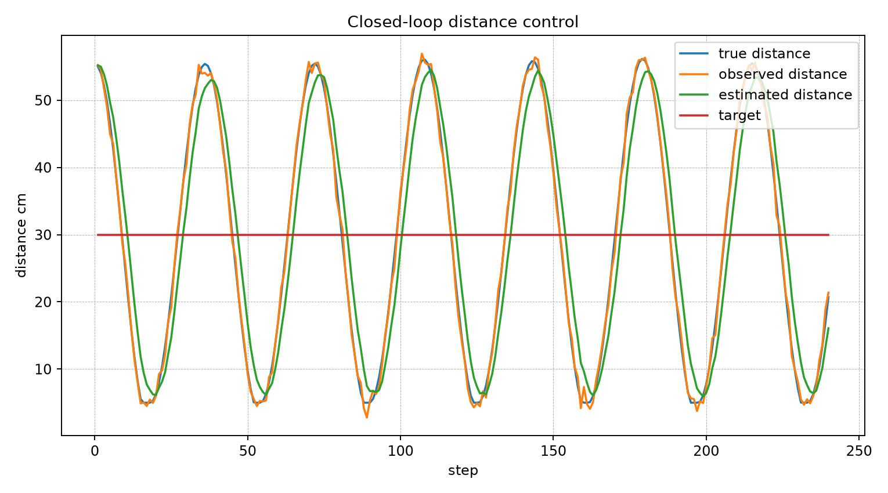
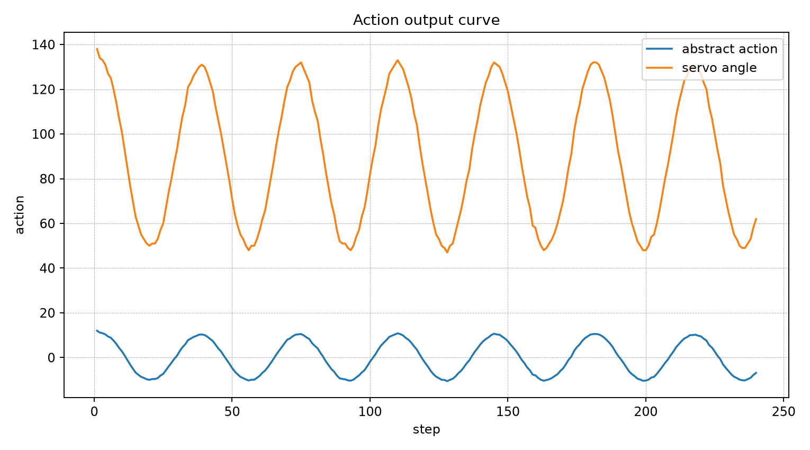
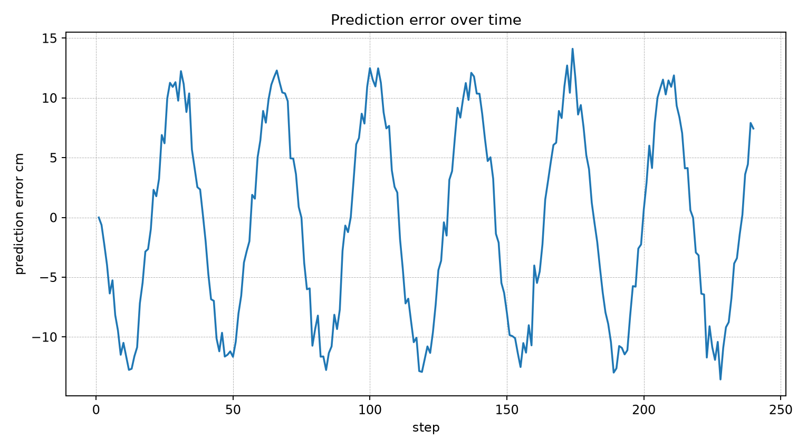
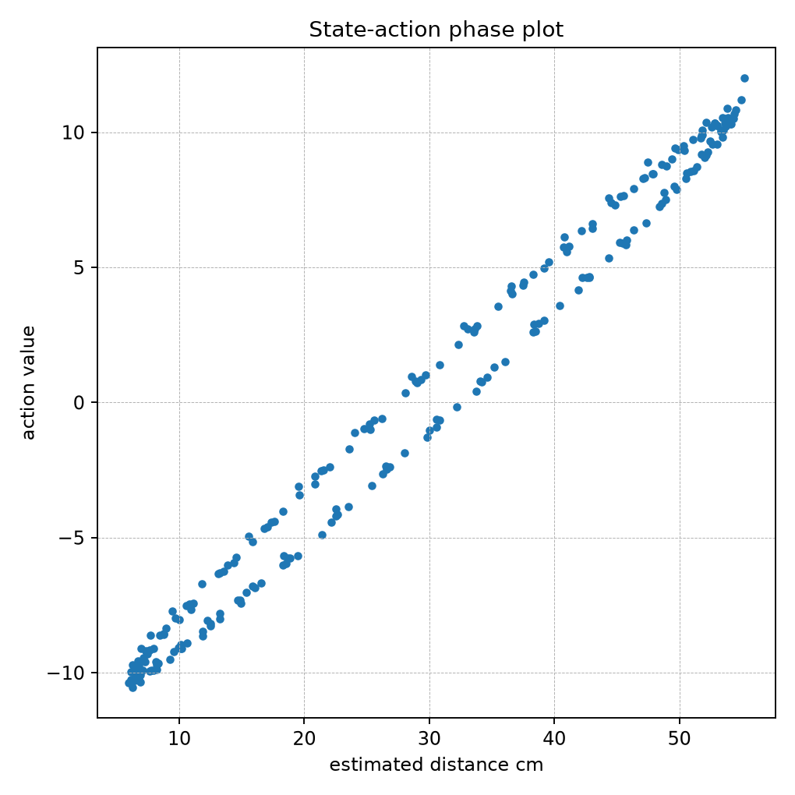

# Embodied Dynamic Cognition I/O

**A closed-loop input-output system that acts on an external space and updates its internal state from the response.**

This project implements a complete prototype of a dynamic cognition device.

It is not a static classifier.  
It is a closed-loop system:

```text
observe external space
→ estimate internal state
→ choose an action
→ act on the external space
→ receive the response
→ update memory and prediction
→ choose the next action
```

The repository includes both:

```text
simulation mode
hardware mode
```

Simulation mode runs entirely on a computer.  
Hardware mode is designed for Arduino/ESP32, a distance sensor, LED, and servo motor.

---

## Core Idea

A normal recognition system works like this:

```text
input → model → output
```

This project works like this:

```text
input → internal state → action → external response → updated input
```

The system therefore treats cognition as a dynamic loop between the agent and its surrounding space.

---

## System Architecture

```text
External Space
   ↑      ↓
Action  Sensor Observation
   ↑      ↓
Actuator ← Controller ← State Estimator ← Sensor Input
                ↓
          Memory / Log / Prediction Error
```

---

## What This Repository Contains

```text
1. Closed-loop simulation environment
2. Sensor abstraction
3. State estimator with memory
4. PID-style action controller
5. Prediction-error logging
6. Hardware serial protocol
7. Arduino sketch for servo / LED / sensor interaction
8. Result visualization
9. Streamlit viewer
10. Research and hardware documentation
11. Tests
```

---

## Setup

```bash
python3 -m venv .venv
source .venv/bin/activate
pip install --upgrade pip
pip install -r requirements.txt
```

---

## Test

```bash
python -m pytest -q
```

Expected:

```text
9 passed
```

---

## Run Simulation

```bash
python scripts/run_closed_loop.py --mode simulation --steps 240
python scripts/replay_logs.py --log logs/closed_loop_log.csv
streamlit run app.py
```

---

## Hardware Mode

```bash
python scripts/run_closed_loop.py --mode hardware --port /dev/tty.usbmodem1101 --steps 240
```

Python sends actuator commands to Arduino.  
Arduino returns distance sensor observations.

---

## Outputs

```text
logs/closed_loop_log.csv
results/distance_control_curve.png
results/action_curve.png
results/prediction_error_curve.png
results/state_phase_plot.png
results/summary_metrics.csv
```

---

## Visual Results

### Distance Control



### Action Curve



### Prediction Error



### State Phase Plot



---

## Suggested GitHub Repository Name

```text
embodied-dynamic-cognition-io
```

## Suggested Description

```text
Closed-loop dynamic cognitive input-output system for acting on an external space and updating internal state from its response.
```

---

## Scientific Position

This repository is a small, inspectable prototype of dynamic cognition through closed-loop interaction.

It demonstrates:

```text
perception
state estimation
memory
action
feedback
prediction error
adaptation
```

The important point is that the system does not only recognize the world.  
It acts on the world and uses the response to update its next action.
